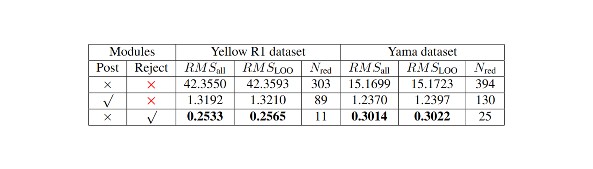
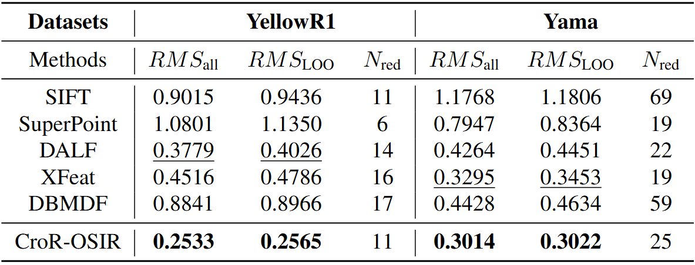
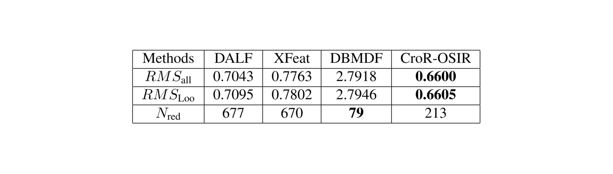

# CroR-OSIR: Cross-Rejective Open-Set SAR Image Registration
# Introduction
This GitHub project is for the rebuttal of CVPR-17772. Due to space limitations, we have uploaded some additional experimental visualization results here. Thank you for your careful review!
# Rejection Mechanism
### Visualization On The Yama Dataset

We conducted experiments on the **Yama dataset** using the SIFT algorithm to detect keypoints. **1223** keypoints were detected in the reference image and **1374** in the sensed image. The encoder was pre-trained for **50 epochs**, followed by training the **R-domain** and **S-domain** classification heads for an additional **50 epochs**. We removed the reject module, with **cross-domain estimation every 5 epochs**. The following registration results were based on matches approved by both branches. We present the results from the **10th cross-domain estimation**. The detailed experimental results are presented in the table below.

#### The visual results without the reject module and without post-processing.

As shown in the above figure, the results without the reject module and any post-processing contain a large number of **redundant point pairs**, which lead to a decrease in matching accuracy. 

Then, we performed **post-processing** to remove erroneous match pairs and visualized the results after eliminating the incorrect matches.

#### The visual results without the reject module and with post-processing.

After applying **RANSAC** for post-processing, incorrect and some redundant point pairs are removed. However, remaining redundant points with insufficient matching quality limit further improvements in registration accuracy.

Then, we compared this result with the one using only the reject module (with a rejection threshold of **0.95**). The results using only the rejection module are shown in the figure below.

#### The visual results with the reject module and without post-processing.

As shown above, the reject module effectively removes incorrect matchings and redundant points, achieving better registration accuracy without post-processing.
### Visualization On The YellowR1 Dataset

On the **YellowR1** dataset, we detected **1339** keypoints in the reference image and **1201** keypoints in the sensed image using the **SIFT** algorithm. Other settings were the same as those for the **Yama** dataset. First, we present the results without the reject module and without post-processing.

#### The visual results without the reject module and without post-processing.

Then, we performed post-processing and present the visualized results below.

#### The visual results without the reject module and with post-processing.

Then, we present the results using only the reject module (rejection threshold = **0.95**).
#### The visual results with the reject module and without post-processing.

# Comparison Visualizations

To further demonstrate the accuracy difference between our method and the comparison methods, we conducted experiments on the **YellowR1** and **Yama** datasets with a rejection threshold of **0.95**. Other experimental settings are as described in Section 4.1 of the paper. We provide the registration point-line diagrams and checkerboard images generated by different algorithms. The point-line diagrams show the number and distribution of the matched points, while the chessboard images more precisely reflect the registration accuracy. The table below shows the actual accuracy on two datasets.

### Visualization results On The Yama Dataset

#### SIFT

#### SuperPoint

#### DALF

#### XFeat

#### DBMDF

#### CroR-OSIR

### Visualization results On The YellowR1 Dataset

#### SIFT

#### SuperPoint

#### DALF

#### XFeat

#### DBMDF

#### CroR-OSIR

# Comparisons on Other Benchmarks
The specific experimental results are shown in the table below.

### DALF

### XFeat

### DBMDF

### CroR-OSIR

<!-- # Installation
## Make Data
## SupCon Pretraining
## CroR-OSR training and the fintune of SupCon module

# Test accurancy -->
